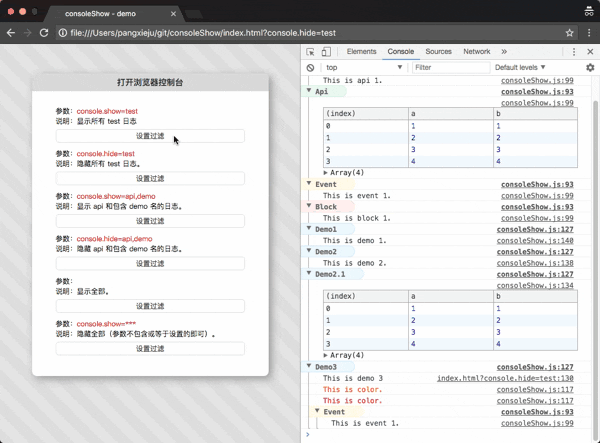

consoleShow
==============================
[](https://badge.fury.io/js/consoleshow)

快捷管理 console，支持自定义命令，支持 url 过滤命令




## 使用指南

安装：

```js
  npm install consoleshow
```

演示地址:

[http://pangxieju.github.io/consoleshow/index.html](http://pangxieju.github.io/consoleshow/index.html)

扩展命令：

* console.test  ：普通输出
* console.api   ：输出接口相关信息
* console.event ：输出事件相关信息
* console.block ：输出块，组件相关信息
* console.color ：修改打印颜色
* console.plus  ：自定义输出信息

```js
  // 默认初始化
  window.consoleShow.config();

  // 清除控制台信息
  window.consoleShow.config({
    clear: true
  });

  // 显示指定 console
  window.consoleShow.config({
    show: [name_1, name_2]
  });

  // 隐藏指定 console
  window.consoleShow.config({
    hide: [name_1, name_2]
  });

  // 扩展命令
  window.consoleShow.config({
    extend: [{
      name: "api",     // 用于控制过滤 console 标记，默认为 test
      type: "table",   // console 默认命令名，默认为 log
      color: "#fff3cf" // 标题颜色，默认色 #ddd
    }]
  });

  // 内联配置
  window.consoleShow.config({
    inlineConfig: true  // 用于设置内联，链式设置
  });
```
#### 注意：

1、扩展 name 参数不允许与 console 命令和扩展命令名相同；

- console 命令："debug", "error", "info", "log", "warn", "dir", "dirxml", "table", "trace", "group", "groupCollapsed", "groupEnd", "clear", "count", "assert", "markTimeline", "profile", "profileEnd", "timeline", "timelineEnd", "time", "timeEnd", "timeStamp", "memory"；（Chrom 浏览器）

- 扩展命令： "test", "event", "api", "block", "color", "plus"；

- 如果与 console 命令名相同，name 会取默认参数 test；如果与扩展命令名相同，会覆盖重名扩展设置。

2、扩展 color 属性只支持 16 进制颜色。

3、扩展 type 参数主要设置输出的控制台命令名，例如：table 等于 console.table。

url 过滤 console：

```
  // 显示当前页面指定 console
  http://xxx.com?console.show=name_1,name_2

  // 隐藏当前页面指定 console
  http://xxx.com?console.hide=name_1,name_2
```

### 扩展命令

1、test, api, event, block 命令;

```js
  // test 为扩展命令名
  console.test('This is test 1.');

  console.test('This is test 1.', 'This is test 1.1.', 'This is test 1.2.');

  // 内联配置(默认内联配置)
  console.test('This is test 2.', {
    config: {
      "name": "@test1",  // 用于控制过滤 console 标记，默认为 test
      "type": "log",     // console 默认命令名，默认为 log
      "color": "#f50"    // 标题颜色，默认色 #ddd
    }
  });

  // 链式配置
  console.config({
    "name": "@test1",  // 用于控制过滤 console 标记，默认为 test
    "type": "log",     // console 默认命令名，默认为 log
    "color": "#f50"    // 标题颜色，默认色 #ddd
  }).test('This is test 2.');
```
#### 注意：

在 webpack 输出中可以配置不生成 console ，一般用于打包到正式；如果在初始化配置中配置 `inlineConfig: false` ，打包正式后控制台会报错。

```js
   // 内联配置
  window.consoleShow.config({
    inlineConfig: false  // 开启链式配置
  });

  // webpack2-3x UglifyJsPlugin 配置
  compressor: {
    drop_console: true // 打包清除 console
  }
```

2、color 命令：console.color(string, color);

```js
  console.color('This is color.');

  console.color('This is color.', "#f00");
```

3、plus 命令：console.plus({options});

```js
  console.plus({
    "name": "demo1",
    "content": "This is demo 1."
  })

  // 注意：当 content 参数为function 时，type 参数无效；
  console.plus({
    "name": "demo2",
    "type": "table",
    "content": "This is demo 2."
  })

  console.plus({
    "name": "demo3",
    "content": function() {
      console.log("This is demo 3");
    }
  })
```
## License
This content is released under the [MIT](http://opensource.org/licenses/MIT) License.
